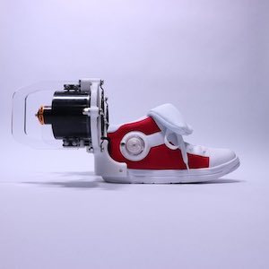
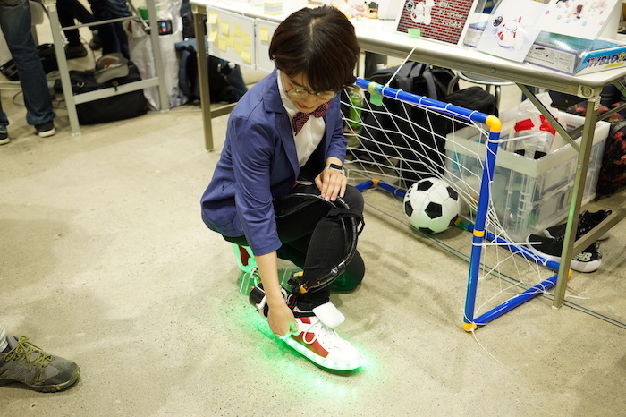

# shoes_mft2018
あるアニメに出てくるシューズを再現してみた

## 材料
- 瞬足とコナンがコラボしてできた[キック力増強シューズ](http://www.chugai-contents.jp/p/conan.html)
- ドローン用のダクテッドファン
- リミットスイッチ
- テープLED
- LiPo
- Arduino
- 3Dプリンタで作ったパーツ

## 作ったもの
- 靴についているダイヤルを回すとリミットスイッチがONになる
- テープLEDが緑、黄、赤、の順に光る
- ファンが一定時間稼働

## Maker Faire 2018に出展
- たくさんの方々に見ていただきました！

